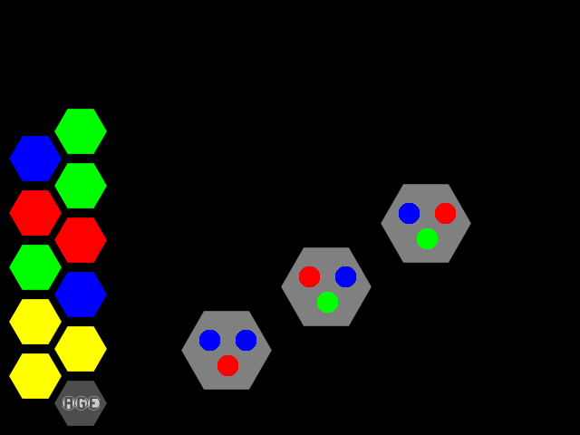
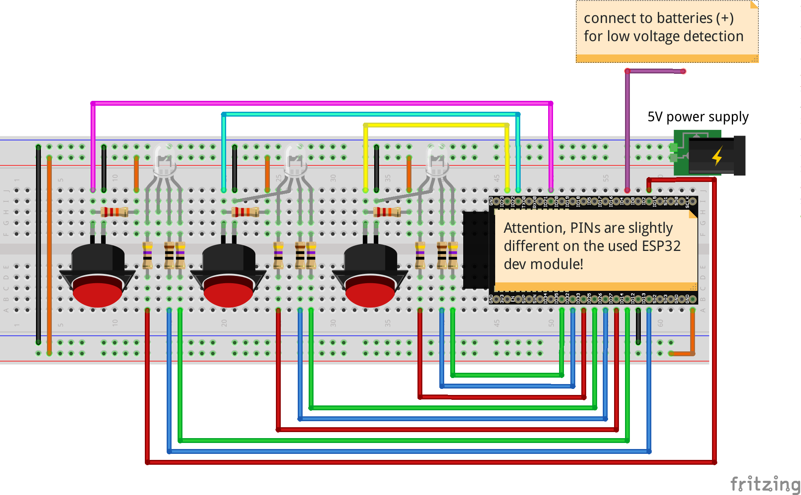

# ring_the_bell
*speedy bees*

## Game Principle
### Rules Of "Climb The Ladder"
The goal of this game is to climb the ladder and ring the bell. But
you won't climb alone. You have to be fast as a team.

The ladder has ten random blinking lights. Every player has a gamepad with three
blinking buttons. They also change the color at random. In one moment a color will
settle on the ladder as one the gamepads. Press as fast as you can all buttons 
with same color. All of you have to do is hit the right button just in time to 
climb one step up.

If one of you ist too slow, the next round will start at the same level.
If one of you hits a wrong button, you fall one step down.

Start of the game will be easy and you will climp up quickly. As you raise level
your time will shorten. Also some unforseen things might happen at any time.

Will you reach the top and ring the bell?


## Software

### Pyglet Prototype
There is a software prototype of the game for easier development, testing
the rules and joy of gameplay.



It uses pyglet as game engine. To use the prototype under Debian Linux run the following commands:
```
cd prototype
apt install python3-pip
pip3 install -r requirements.txt
python3 prototype.py
```

### Game States
There is only a limited number of differnent states in the game. Test them in
the prototype with the letters in the brackets.
* [s] start
* [t] request gamepads to resync their time (ntp)
* [r] random blinking
* [f] freeze, wait for reactions
* [e] release
* [u] level up
* [d] level down
* [w] win
* [q] quit


### Gamecontrolmaster
Raspberry Pi with Raspbian (Debian Stretch)

* You will need these essential Debian packages for gamemaster:
  * `python3 ntp`
  * Also install python3 from requirements.txt.
* There is no standalone mode yet. Use the gamemaster headless via ssh, in addition with the following handy packages:
  * `git` - to get the software
  * `screen` - for disruptable ssh sessions
  * `htop` - resource monitoring
  * `mc` - commandline file manager
  * `tcpdump` - debug network traffic
  * `vim` - file editor
* For all features install a dekstop like fluxbox
  * `lightdm fluxbox lxterminal bbrun`

#### Components
* wifi in AP mode
  * name: "speedy bees"
  * password: "rockyoursocksoff"
  * IP address: 172.16.2.2
  * or set up a separate access point instead of the onboard chip
    * switch wifi to client mode on Pi
    * leave IP address of Rapsberry Pi: 172.16.2.2
    * set IP address of access point: 172.16.2.1
    * use same wifi name + credentials or recompile firmware for gamepads
    * enable DHCP server on access point for address range: 172.16.2.3 - 172.16.2.254
    * no internet connection or DNS is needed
* ntp server - add this line to /etc/ntp.conf:
  * restrict 172.16.2.0 mask 255.255.255.0 nomodify notrap
* open firewall ports:
  * 123 for ntp
  * 3333 for ingame udp server
* start prototype.py
  * starts UDP server in separate thread
  * shows game state on screen
  * send UDP packets with game state
  * recieves UDP packets with buttons states from pads

#### UDP Packets
* modus can be:
  * 0: nothing
  * 1: Helo
  * 2: Freeze
  * 3: Release
  * 4: NTP resync
  * 5: Animation1
  * 6: Animation2

### Gamepads
The Gamepads are self made and consist of a wifi enabled microcontroller
(esp32), three buttons and three rgb LEDs (see Hardware). Adopt the .ino
firmware file to your needs (like wifi password, IP addresses, etc.) and flash
it to the esp32.

* gamepad.ino
  * connects to wifi AP
  * recieves time from local ntp server
  * recieves commands from gamecontrolmaster
    * game states
    * ntp resync
  * animates button colors
  * sends button states to master

Remember you have to recompile the firmware and flash it again on all gamepads after making
changes to your wifi or network setup.

#### Flashing the Firmware
Easiest way of flashing is by using the Arduino IDE. Enhance it with the software from
espressif to flash esp32 boards.

* Install the current upstream Arduino IDE at the 1.8 level or later. The current version is at the [Arduino website](http://www.arduino.cc/en/main/software).
* Start Arduino and open Preferences window.
* Enter ```https://dl.espressif.com/dl/package_esp32_index.json``` into *Additional Board Manager URLs* field. You can add multiple URLs, separating them with commas.
* Open Boards Manager from Tools > Board menu and install *esp32* platform (and don't forget to select your ESP32 board from Tools > Board menu after installation).

* [Espressif Esp32 @ github](https://github.com/espressif/arduino-esp32)

#### UDP Packets
* timestamp, button1, color, dt, button2, color, dt, button3, color, dt
 * dt means after how many ms button was last pressed in this second
 * e.g.: "1546727493, 1,1,0, 2,3,427, 3,1,755"
* debug with any linux computer in the same wifi with: `sudo tcpdump -vvv -l -n port 3333`

#### Gamepad States
To lower complexity the gamepad software is written as a state machine. See
https://www.norwegiancreations.com/2017/03/state-machines-and-arduino-implementation/
for a quick introduction.

* states:
  * [1] random blinking
  * [2] freeze
  * [3] send udp packet
  * [4] recieve udp packet
  * [5] blink buttons pressed right in time
  * [6] sync time
* inputs:
  * udp packets
* outputs:
  * LEDs
  * udp packets

----
## Hardware

Gamecontrolmaster and Gamepads
### Gamecontrolmaster
Setup: Raspberry Pi <-- USB --> USB DMX controller <-- DMX --> RGB Lights

### Gamepad Schematics
Setup: BMS <--> Li-Ion battery 4.2V <--> 5V step up <--> ESP32 dev board <--> 3.3V buttons & LEDs

There are 2 Batteries in parallel with 2.200mAh each. The Gamepads uses between
70mA and 200mA. So you should be able to play at least 24h. 8) Recharge via USB
or change the cells. You find many of them in old notebook batteries.

ESP32 Pinmap:


Wiring of buttons and LEDs to the ESP32:



* https://randomnerdtutorials.com/esp32-pinout-reference-gpios/
* https://github.com/troelssiggaard/ESP32-fritzing-module - ESP32 wroom Fritzing part


### Bill Of Material
All electronic parts are easy to find in online shops (therefroe no links).

The wood was bought as a big board and cut in pieces with a handsaw.

Costs for the lights are high because of professional equipment (the cheapest)
with DMX. That way all components are also usable for other light
installations. You can save a lot of money building the lights yourself (see
DIY RGB LEDs below).

#### Gamecontrolmaster 
Number | Name | Sum
------ | ---- | -----
1x | Pi3 with case, sd-card and power supply | 50€
1x | Enttec Open DMX USB | 70€
| **sum** | **ca. 120€**

#### Light Bar
Number | Name | Sum
------ | ---- | -----
1x | RGB Light with DMX controller | 200€
11x | combs from six pieces of wood (12mm x 12mm x 12mm)| 30€
11x | milk glass as front plate for combs (24mm x 24mm) | 70€
11x | wooden back plate for combs (24mm x 24mm) | 50€
1x | potentiometer for setting difficulty | 1€
| speaker |
| car horn |
| **sum** | **ca. 350€**

#### Gamepads
These are the parts for one gamepad. The gamedesign is optimised for three
players. But you can easily connect more. The limiting factor will be the
number of wifi connections handled by the Pi. In case you're planning with some
dozens gamepads better use a separated wifi access point.

Number | Name | Sum
------ | ---- | -----
1x | Espressif ESP32 (or similar board) | 7€
1x | li-ion battery management system (BMS) | 1€
1x | 5V step up | 1,50€
1x | battery holding for two 18650 cells (parallel) | 2€
2x | batteries 18650 li-ion (from old notebook) | 0€
1x | flip switch | 1€
3x | arcade buttons | 3,60€
3x | RGB LED (common cathode) for buttons | 0,30€
6x | 47 Ohm resistor | 0,01€
3x | 10 Ohm resistor | 0,01€
3x | 22 kOhm resistor | 0,01€
1x | combs from six pieces of wood (12mm x 12mm x 9mm)| 3€
| **sum** | **ca 20€ (each)**

----
## RGB Light

### Tri LED Show Bar DMX
Use standard hardware for theaters and clubs, allows better scaling and reuseable elements.

* USB to DMX adapter
  * Enttec Enttec Open DMX USB (70€)
  * Enttec DMX USB Pro MK2, with Linux support (190€)
* Light Bars (200-400€)
  * https://www.thomann.de/de/stairville_show_bar_triled_18x3wb_stock.htm
  * https://www.ebay.de/itm/Showtec-Cameleon-Bar-12-3-IP65-LED-12x-3W-RGB-Light-DMX-Lichtleiste-Outdoor-/201976229900
  * https://www.ebay.de/itm/U-king-72W-10PCS-36LED-Par-RGB-Buhnenlicht-DMX-512-Disco-DJ-Wedding-Party-Lichts/292784228642?hash=item442b4cc922:g:irwAAOSwRNhbzr0r:rk:13:pf:0
  * https://www.ebay.de/itm/U-king-10STK-36W-Buhnenlicht-18LED-Par-RGB-Licht-7CH-Channel-Disco-Wedding-Party/292806135256?_trkparms=aid%3D444000%26algo%3DSOI.DEFAULT%26ao%3D1%26asc%3D20170221122447%26meid%3D339054517f2c4988a4da3474d06ac717%26pid%3D100752%26rk%3D3%26rkt%3D6%26sd%3D292784228642%26itm%3D292806135256&_trksid=p2047675.c100752.m1982
  * https://www.ebay.de/itm/10stk-RGBW-12LED-Par-Buhnenbeleuchtung-DMX512-Licht-Disco-Party-Lichteffekt-F2Y1/183417140600?_trkparms=aid%3D222007%26algo%3DSIM.MBE%26ao%3D1%26asc%3D52545%26meid%3D2c4fce730ffb4a258fd2ce8ef1319b32%26pid%3D100010%26rk%3D6%26rkt%3D12%26sd%3D292784228642%26itm%3D183417140600&_trksid=p2047675.c100010.m2109
  * https://www.ebay.de/itm/24x-3W-RGB-LED-Bar-Wall-Washer-8-Sektionen-DMX-Stage-Scheinwerfer-Lichtleiste/332858111664?epid=26014989146&hash=item4d7fe3b6b0:g:gCoAAOSwhZ5b1vIN:rk:10:pf:0
* LED Par
  * https://www.amazon.de/dp/B07D8MHP9J/ref=psdc_528377031_t1_B07J4TPDG2
  * https://www.amazon.de/dp/B07G87HGR8/ref=psdc_528377031_t3_B07J4TPDG2
  * https://www.amazon.de/Bühnenbeleuchtung-Latta-Alvor-Lichteffekte-Partybeleuchtung/dp/B07BN9SH4J/

* [Dip Switch Calculator](https://www.chauvetdj.com/chauvet-dj-dip-switch-calculator/)

#### Enttec DMX USB Pro Mk2
You a need an USB controller for sending DMX signals to the lights.

* After connection to your computer, the LED on the PRO Mk2 will start blinking white, notifying that it's powered up and ready.
* [DmxPy](https://github.com/trevordavies095/DmxPy) - Control USB-DMX Hardware with Python 3. Works with Raspberry Pi and supports Enttec DMX USB Pro.
  * is included in the prototype
* [Open Lighting Architecture](https://www.openlighting.org/) - take a look if you're thinking bigger

### DIY Power LED
This is way cheaper than DMX Hardware. You basically need some power LEDs and a
multiplexer. You won't need DMX but will have fun with you own protocol.

* 10x RGB 3W LED
* 3.3V multiplexer 
 * for arduino a 5V would do it: 74HCT245
* some Darlington ULN2003A 
  * 500mA per channel; multi channel possible
  * or use 30x 3.3V n-channel mosfet

* https://learn.adafruit.com/rgb-led-strips/usage
* http://www.tbideas.com/blog/build-an-arduino-shield-to-drive-high-power-rgb-led/

### DIY LED Stripes, Neopixel
Cut stripes in pieces and bring them in form for the combs. Control with
mosfets or darlington + multiplexer (same as with power LEDs).

* https://dordnung.de/raspberrypi-ledstrip/ws2812
* https://diystagedesign.wordpress.com/2014/06/06/rgb-led-strip-panels/
* https://www.instructables.com/id/Driving-RGB-LED-strips-off-an-Arduino/
* https://www.hackerspace-bamberg.de/Dmx2rgb

