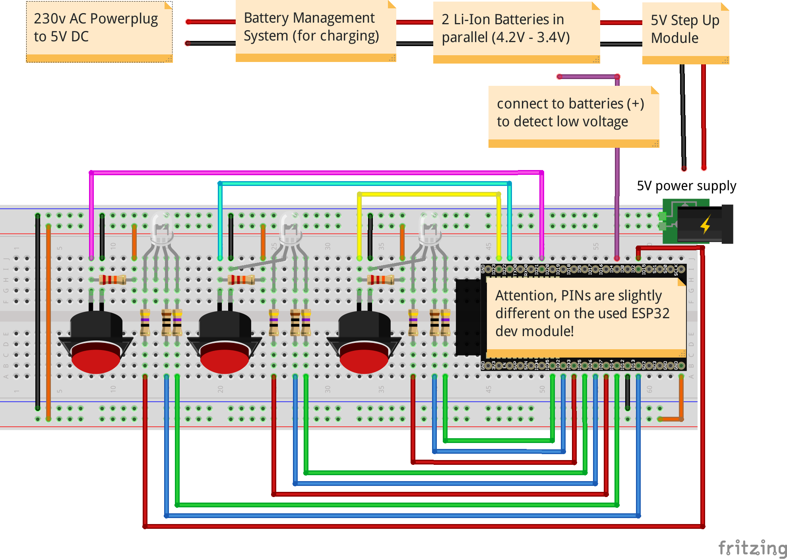

# Gamepads

The Gamepads are self made and consist of a wifi enabled microcontroller (esp32), three buttons and three rgb LEDs. Adopt the .ino firmware file to your needs (like wifi password, IP addresses, etc.) and flash it to the esp32.

* gamepad.ino
  * connects to wifi AP
  * recieves time from local ntp server
  * recieves commands from gamecontrolmaster
    * game states
    * ntp resync
  * animates button colors
  * sends button states to master

Remember you have to recompile the firmware and flash it again on all gamepads after making
changes to your wifi/network setup.


## Gamepad Schematics

Setup: BMS :left_right_arrow: 2x Li-Ion battery 4.2V :left_right_arrow: 5V step up :left_right_arrow: ESP32 dev board :left_right_arrow: 3.3V buttons & LEDs

Wiring of batteries, buttons and LEDs to the ESP32:



Two batteries are used in parallel with 2.200mAh each. The Gamepad uses between 70mA and 200mA. So you should be able to play at least 24h. 8) 
It will blink red and poweroff if battery voltage is below 3.4V. Recharge via USB, powerplug or change the cells. You find many of them in old notebook batteries.

ESP32 Pinmap:


* [ESP32 Pin Reference](https://randomnerdtutorials.com/esp32-pinout-reference-gpios/)
* [ESP32 wroom Fritzing part](https://github.com/troelssiggaard/ESP32-fritzing-module)


## Flashing the Firmware

Easiest way of flashing is by using the Arduino IDE. Enhance it with the software from
espressif to flash esp32 boards.

* Install the current upstream Arduino IDE at the 1.8 level or later. The current version is at the [Arduino website](http://www.arduino.cc/en/main/software).
* Start Arduino and open Preferences window.
* Enter ```https://dl.espressif.com/dl/package_esp32_index.json``` into *Additional Board Manager URLs* field. You can add multiple URLs, separating them with commas.
* Open Boards Manager from Tools > Board menu and install *esp32* platform.
* Select your ESP32 board from Tools > Board menu after installation (in our case "NodeMCU-32S").

* [Espressif Esp32 @ github](https://github.com/espressif/arduino-esp32)


## Gamepad States

To lower complexity the gamepad software is written as a state machine. See
https://www.norwegiancreations.com/2017/03/state-machines-and-arduino-implementation/
for a quick introduction.

* states:
  * [1] random blinking
  * [2] freeze
  * [3] send udp packet
  * [4] recieve udp packet
  * [5] blink buttons pressed right in time
  * [6] sync time
* inputs:
  * udp packets
* outputs:
  * LEDs
  * udp packets


### UDP Packets
* timestamp, button1, color, dt, button2, color, dt, button3, color, dt
 * dt means after how many ms button was last pressed in this second
 * e.g.: "1546727493, 1,1,0, 2,3,427, 3,1,755"
* debug with any linux computer in the same wifi with: `sudo tcpdump -vvv -l -n port 3333`
* modus can be:
  * 0: nothing
  * 1: Helo
  * 2: Freeze
  * 3: Release
  * 4: NTP resync
  * 5: Animation1
  * 6: Animation2


## Open Hardware Power Supply
There are plenty of cheap commercial modules available. One is used for the prototype. You could go the full open hardware path by replacing them. Here are some ideas:

* li-ion battery management system
  * https://easyeda.com/search?wd=li-ion%20bms
  * https://github.com/stuartpittaway/diyBMS
  * https://secondlifestorage.com/index.php
  * https://www.youtube.com/watch?v=OdH3wYeFJ3M
  * https://foxbms.org
  * https://github.com/Teslafly/OpenBMS

* 5V step up boost module
  * https://chioszrobots.com/2013/10/11/dc-dc-1a-3v-to-5v-converter-step-up-boost-module/
  * https://easyeda.com/oshw/Arduino_Pro_Mini_328_5V_16MHz_Open_hardware-PuigQOLlx


